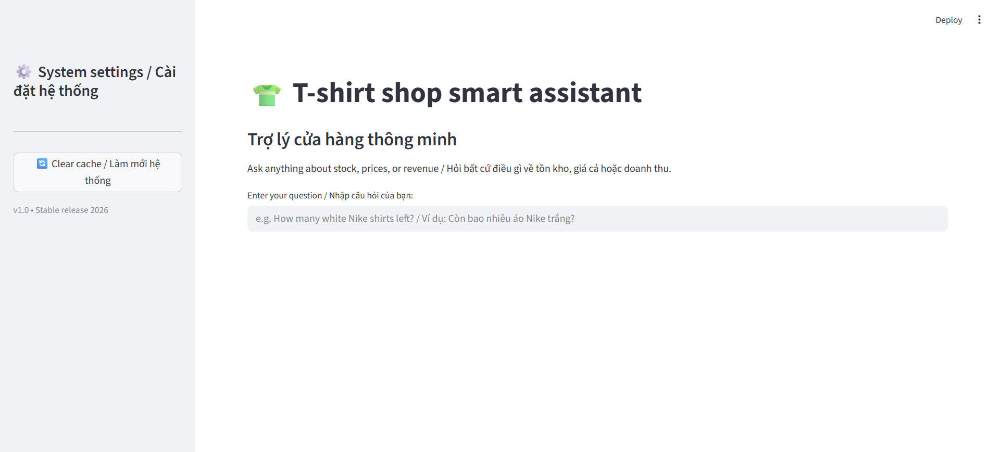
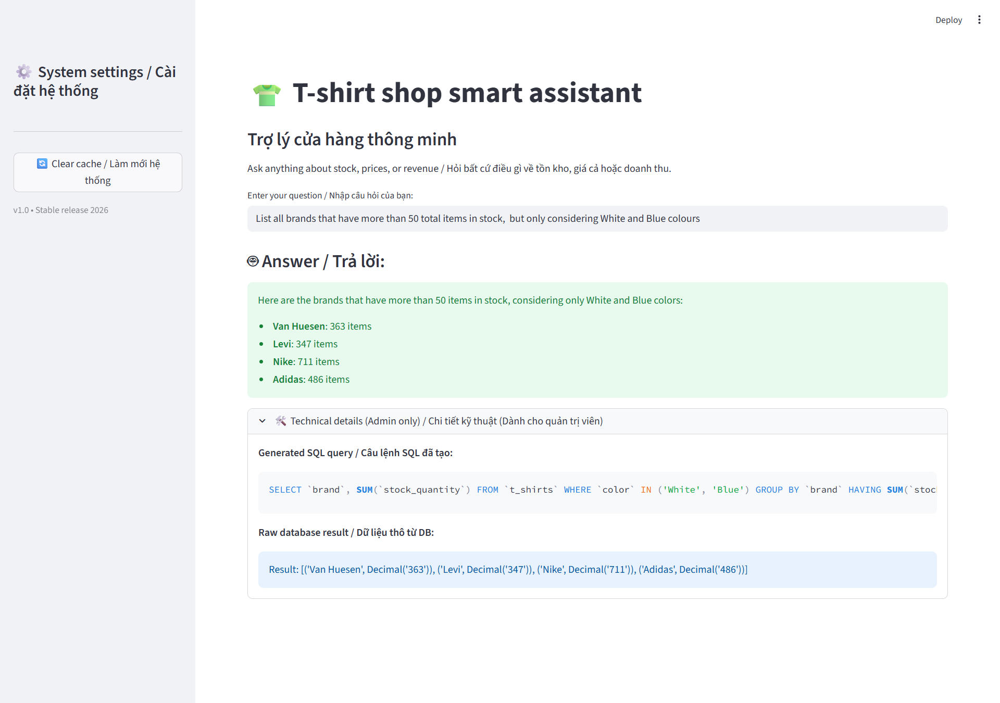
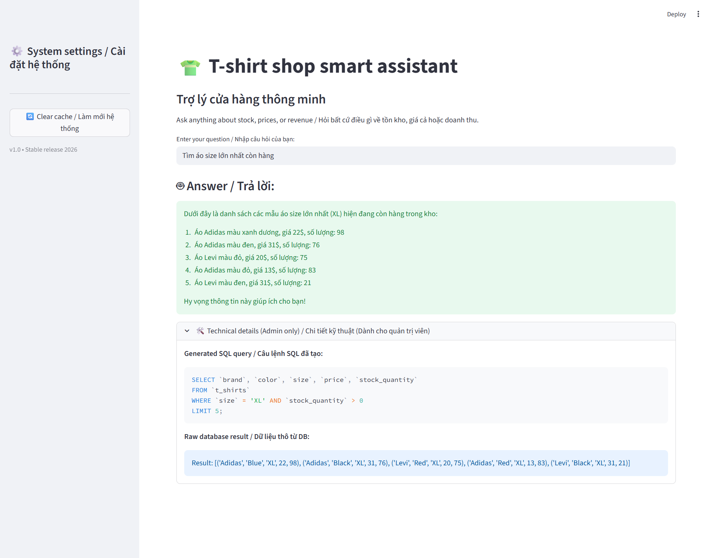

# 🤖 Bilingual Text-to-SQL AI Assistant Demo for Retail Inventory

This project is an AI-powered assistant that allows users to query a T-shirt inventory database using natural language in both English and Vietnamese.

Instead of writing SQL manually, users can ask questions such as:
- "How many red T-shirts are in stock?"
- "Áo size M còn bao nhiêu cái?"

The system automatically converts these queries into SQL, executes them on a MySQL database, and returns a human-readable answer.


[](https://opensource.org/licenses/MIT)

---

## 🌟 Overview
This project demonstrates an end-to-end **Text-to-SQL pipeline** built using **LangChain** and **Google Gemini 3.1 Flash-lite-preview**.

The system enables natural language interaction with structured relational data, making database querying accessible to non-technical users.

Key capabilities include:
- Natural language understanding (English & Vietnamese)
- SQL query generation
- Query execution on MySQL database
- LLM-based response synthesis

---

## ✨ Key Features

- **End-to-End AI Pipeline**  
  Streamlit UI → LangChain Text-to-SQL chain → MySQL execution → LLM response generation.

- **Bilingual Query Support**  
  Handles both English and Vietnamese queries using few-shot prompting and semantic similarity retrieval.

- **Text-to-SQL Generation**  
  Converts natural language questions into syntactically correct and context-aware MySQL queries.

- **Few-shot Learning with Semantic Retrieval**  
  Uses ChromaDB + sentence-transformers to retrieve relevant examples dynamically for better SQL generation.

- **Dynamic Inventory Simulation**  
  SQL-based scripts generate test scenarios with varying stock levels for robust evaluation.

- **LLM-Powered Reasoning**  
  Built using Google Gemini 3.1 Flash-lite for fast inference and structured reasoning.

---

## 🏗️ System Architecture

```bash
User Question
      ↓
Streamlit UI (app.py)
      ↓
LangChain Engine Initialisation (cached)
      ↓
ChromaDB Semantic Retrieval (Few-shot examples)
      ↓
Gemini LLM → SQL Query Generation
      ↓
MySQL Execution (QuerySQLDataBaseTool)
      ↓
Gemini LLM → Natural Language Answer Generation
      ↓
Final Response (Streamlit UI)
```

---

## 🛠️ Tech Stack

- **LLM:** Google Gemini 3.1 Flash-lite-preview  
- **Framework:** LangChain  
- **Frontend:** Streamlit  
- **Database:** MySQL  
- **Vector Database:** ChromaDB  
- **Embeddings:** HuggingFace sentence-transformers (all-MiniLM-L6-v2)  
- **Language:** Python 3.10  

---

## 📂 Project Structure
```bash
tshirt-inventory-ai-assistant/
├── notebooks/
│   └── text_to_sql_chain_testing.ipynb  # R&D and logic testing
├── screenshots/
│   ├── chat_english.png            
│   ├── chat_vietnamese.png         
│   └── demo_ui.png                 
├── sql/
│   ├── t_shirts_schema.sql              # Database schema and data initialisation
│   └── query_to_test_llm.sql            # Test queries for evaluation
├── src/
│   ├── database.py                      # MySQL connection handler
│   ├── prompts.py                       # Few-shot templates and system instructions
│   └── text_to_sql_chain.py             # Core Text-to-SQL pipeline
├── .env.example                         # Template for environment variables
├── .gitignore                      
├── app.py                               # Main Streamlit web application
├── LICENCE                         
├── README.md                       
└── requirements.txt               

```
---

## 🚀 How It Works

1. The user submits a natural language question through the Streamlit interface.
2. The system retrieves semantically similar few-shot examples from ChromaDB to improve context understanding.
3. The LLM (Google Gemini 3.1 Flash-lite) generates a syntactically valid MySQL query based on the input and retrieved examples.
4. The generated SQL query is executed against the MySQL database.
5. The raw SQL result is passed back to the LLM for natural language interpretation.
6. The final response is displayed to the user via the Streamlit UI.

---

## 📸 Demo

### 🔹 Main UI


### 🔹 English Query Example


### 🔹 Vietnamese Query Example


---

## ⚙️ Setup & Installation
### 1. Clone repository

```bash
git clone https://github.com/ledinhtan/tshirt-inventory-ai-assistant.git
cd tshirt-inventory-ai-assistant
```

### 2. Install dependencies:

```bash
pip install -r requirements.txt
```

### 3. Create environment variables

Create a `.env` file:
```bash
cp .env.example .env
```
Example configuration:
```env
GOOGLE_API_KEY=your_api_key
DB_USER=root
DB_PASSWORD=your_password
DB_HOST=localhost
DB_NAME=atliq_tshirts
```

### 4. Run the application
```bash
streamlit run app.py
```

---

## 📜 License

- **Code**: MIT License (see [LICENSE](LICENSE) file)